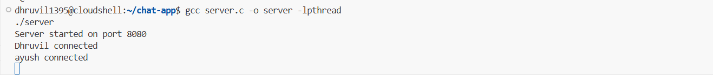
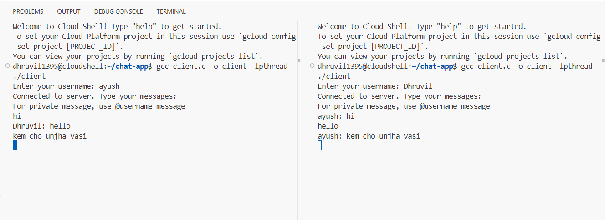
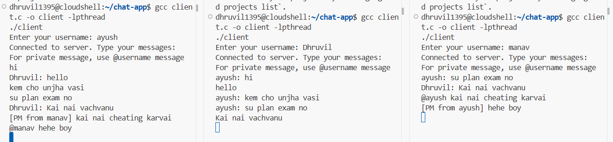

Here's the updated `README.md` documentation with the necessary additions including the headers used in the server code and integration of the full `server.c` implementation:

---


# Socket Programming Assignment - Code Documentation

## Table of Contents
1. [Project Structure](#project-structure)
2. [Server Implementation](#server-implementation)
   - [Header Files](#header-files)
   - [Data Structures](#server-data-structures)
   - [Thread Handling](#thread-handling)
   - [Message Processing](#message-processing)
3. [Client Implementation](#client-implementation)
   - [Connection Setup](#connection-setup)
   - [Message Handling](#message-handling)
4. [Key Functions](#key-functions)
5. [Flow Diagrams](#flow-diagrams)
6. [Compilation & Execution](#compilation--execution)
7. [Screenshots](#screenshots)


## Project Structure


chat-app/

├── server.c        
├── client.c        
└── README.md       


## Server Implementation

### Header Files

Make sure to include the following headers in `server.c`:

```
#include <stdio.h>
#include <stdlib.h>
#include <string.h>
#include <unistd.h>
#include <sys/socket.h>
#include <netinet/in.h>
#include <pthread.h>
```

---

### Server Data Structures

```c
#define MAX_CLIENTS 10
#define BUFFER_SIZE 1024

typedef struct {
    int socket;
    char username[32];
} Client;

Client clients[MAX_CLIENTS];
pthread_mutex_t clients_mutex = PTHREAD_MUTEX_INITIALIZER;
```

---

### Thread Handling

- The main thread:
  - Creates and binds a socket on port 8080
  - Listens for connections
  - Accepts incoming clients and spawns a thread for each

```c
while (1) {
    new_socket = accept(server_fd, (struct sockaddr *)&address, &addrlen);
    pthread_mutex_lock(&clients_mutex);
    for (int i = 0; i < MAX_CLIENTS; i++) {
        if (clients[i].socket == 0) {
            clients[i].socket = new_socket;
            pthread_t thread;
            pthread_create(&thread, NULL, handle_client, &clients[i]);
            break;
        }
    }
    pthread_mutex_unlock(&clients_mutex);
}
```

---

### Message Processing

- **Private Messages**: Sent using `@username message` syntax.
- **Broadcast Messages**: Sent to all other clients.

```c
if (buffer[0] == '@') {
    char *recipient = strtok(buffer + 1, " ");
    char *message = strtok(NULL, "\n");

    pthread_mutex_lock(&clients_mutex);
    for (int i = 0; i < MAX_CLIENTS; i++) {
        if (clients[i].socket != 0 && strcmp(clients[i].username, recipient) == 0) {
            char private_msg[BUFFER_SIZE];
            snprintf(private_msg, sizeof(private_msg), "[PM from %s] %s", client->username, message);
            send(clients[i].socket, private_msg, strlen(private_msg), 0);
            break;
        }
    }
    pthread_mutex_unlock(&clients_mutex);
} else {
    pthread_mutex_lock(&clients_mutex);
    for (int i = 0; i < MAX_CLIENTS; i++) {
        if (clients[i].socket != 0 && clients[i].socket != client->socket) {
            char broadcast_msg[BUFFER_SIZE];
            snprintf(broadcast_msg, sizeof(broadcast_msg), "%s: %s", client->username, buffer);
            send(clients[i].socket, broadcast_msg, strlen(broadcast_msg), 0);
        }
    }
    pthread_mutex_unlock(&clients_mutex);
}
```

---

## Client Implementation

### Connection Setup

```c
sock = socket(AF_INET, SOCK_STREAM, 0);

serv_addr.sin_family = AF_INET;
serv_addr.sin_port = htons(8080);
inet_pton(AF_INET, "127.0.0.1", &serv_addr.sin_addr);

connect(sock, (struct sockaddr*)&serv_addr, sizeof(serv_addr));
```

---

### Message Handling

```c
void *receive_handler(void *arg) {
    while (1) {
        int receive = recv(sock, buffer, BUFFER_SIZE, 0);
        if (receive <= 0) break;
        buffer[receive] = '\0';
        printf("%s\n", buffer);
    }
}

pthread_create(&recv_thread, NULL, receive_handler, NULL);
```

---

## Key Functions

| Function             | Description                                      |
|----------------------|--------------------------------------------------|
| `handle_client()`     | Server thread to manage each client             |
| `receive_handler()`   | Client-side thread to print incoming messages   |
| `send()` / `recv()`   | Communication through sockets                   |
| `pthread_create()`    | Thread initialization                           |
| `pthread_mutex_lock()`| Ensures thread-safe client list manipulation   |

---

## Flow Diagrams

### Server Workflow

```
1. Initialize socket
2. Bind to port 8080
3. Listen and accept connections
4. On new connection:
   a. Assign to client slot
   b. Spawn thread
5. In client thread:
   a. Get username
   b. Receive messages
   c. Broadcast or send privately
   d. Handle disconnect
```

### Client Workflow

```
1. Connect to server
2. Send username
3. Create receive thread
4. Main thread sends user input
5. Receive thread prints messages
```

---

## Compilation & Execution

```bash
gcc server.c -o server -lpthread
gcc client.c -o client -lpthread

./server

./client
```

---

## Screenshots

### Compiling and Running Server



### Running Clients with Usernames: dhruvil, ayush, manav





---

## Important Notes

- **Thread-Safety**: All shared data access is protected with mutexes.
- **No Authentication**: Clients are identified by username only.
- **No Message History**: No logs or file saving implemented.
- **Scalability**: Fixed limit of 10 clients.


